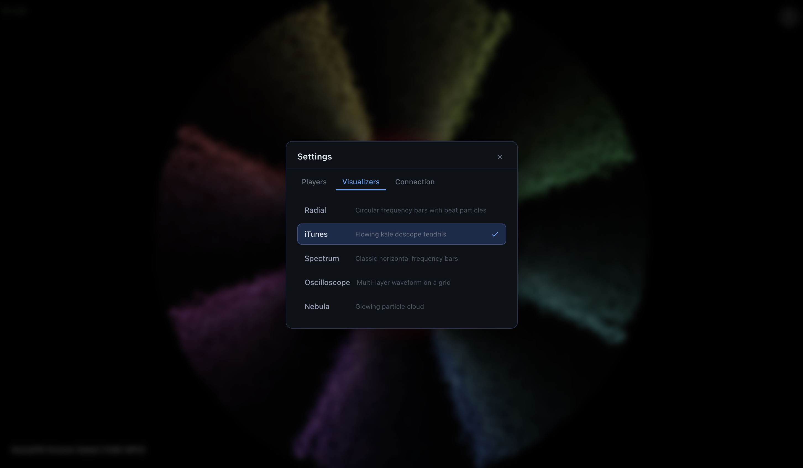

# MA Visualizer



A full-screen audio visualizer for [Music Assistant](https://music-assistant.io/), running in the browser. Connects via [Sendspin](https://sendspin.io/) for real-time audio analysis and displays reactive visuals synchronized to your playing music.

## Features

- **5 visualizer types** — Radial, iTunes, Spectrum, Oscilloscope, Nebula
- **Auto-sync** — groups the visualizer player with your selected MA player; pause, resume, and track changes propagate automatically
- **Track info overlay** — shows album art, track name, and artist
- **No audio output** — analysis only, browser stays silent
- **Safari compatible**

## Requirements

- [Music Assistant](https://music-assistant.io/) server with the Sendspin provider installed
- Node.js 18+

## Setup

```bash
npm install
npm run build
node serve.js
```

Open [http://localhost:3002](http://localhost:3002).

## Configuration

1. Click the **⋮** menu → **Settings → Connection**
2. Enter your MA server URL (e.g. `http://192.168.1.x:8095`) and API token
3. Click **Save & Connect**
4. Go to **Players** tab, select a playing player
5. Click **Connect Sendspin** — visuals start automatically

Your settings are saved in localStorage and persist across sessions.

## Visualizers

| Name | Description |
|------|-------------|
| Radial | Circular frequency bars with beat particles and inner reflection |
| iTunes | 8-fold kaleidoscope tendrils with slow rotation and long trails |
| Spectrum | Horizontal frequency bars with gradient fill and floor reflection |
| Oscilloscope | 3-layer waveform on a dark grid |
| Nebula | Glowing particle cloud expanding from center |

Switch between them in **Settings → Visualizers**.

## Architecture

```
serve.js          — Node HTTP server (port 3002), WS proxy for Sendspin, image proxy for album art
src/
  App.vue                        — MA connection, Sendspin grouping, analyser tap
  components/Visualiser.vue      — Canvas draw loop, all 5 visualizer types
  components/Settings.vue        — Settings panel (Players / Visualizers / Connection tabs)
  composables/useMusicAssistant.js — MA WebSocket client (players, queues, commands)
  composables/useSendspin.js     — Sendspin WS bridge + Web Audio tap
```

## How it works

1. Connects to MA via WebSocket to receive player/queue state
2. On "Connect Sendspin", registers a new Sendspin player in MA
3. Groups the Sendspin player to your selected player (`players/cmd/group`)
4. Taps the incoming MediaStream with the Web Audio API (`createMediaStreamSource`)
5. Feeds frequency and time-domain data to the canvas visualizer at 60fps
6. Mirrors pause/resume from the selected player to the Sendspin player

## License

MIT
